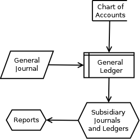

 

</img>

# Accounting System

A basic accounting system compliant with Generally Accepted Accounting Practice (or Principles) (GAAP). It is written in python 3.7 and SQLite3.

## Introduction  
  
There are lots of accounting information systems both proprietary and free and open source. I needed a project to exercise my python, sql and tkinter coding. The fact that it is a necessary review of my MBA curriculum doesn't hurt either after a long absence of my attention there. Finally, I think another open source offering is good and this is intened be a simple, straight forward, and transparent development offering of a accounting application. 

## Principle 
The central core of accounting is considered to be the General Ledger. The instrument of first entry however is the General Journal. All other aspects of the system are either suecondary entry or subsidieary journals and reoprts. The well known Balance Sheet, the consolidated picture of an enterprise, is a report based on the General Ledger contents.

The entry of business activities is first into the Journal, or day book. The items of the Journal are posted then to the Ledger. The double entry technique of accounting ensures that the credit accounts and the debit accounts remain in balance. If the credits always equal the the debits from the outset, and there is no other confounding entries allowed balance is retained. This is a kind of drudge task for which computer programs is eminently suited.

It should be impossible to enter any accounting data except through the general journal. Accounts should be easily added but not removable unless never referenced in transactions (i.e There must never have been any entries for the account in the current fiscal cycle (year), meaning since the books were last closed out).

## Approach
Thus the Journal is where data enters the system and is the date-time record of activity. Data is then reorganized and transferred to the Ledger. The ledger is the categorized permanent record of the enterprise's functioning - taking in revenue and paying expenses to produce some value. The business operation is accountable to internal and external stakeholders. This accounting to stakeholders requires a data trail is maintained with integrity and be demonstable on demand. The audit trailas it is called must be immutable right to the reports needed to account to stakeholders.



The underlying categorization is defined by a set of accounts to which activities are attributated. This is kept in the Chart of Accounts. In modern American GAAP there are five essential accounts aways present as prinary accounts with variable kinds of subsidiary accounts providing a detailed breakdown of these five. These in the US, Canada and the UK are 1) Assets Account, 2) Liabilities Account, 3) Equity or Capital Accounts, 4) Revenue or Income Account and 5) Expense of Costs Account. There is usually some way to remove bad data or expired value from the system. This sixth account or Disposables (6) is how depreciated value, bad debts and perhaps erroneous data, can be removed from the system in a clearly demonstrable and auditable way. 
  
Often the write--ff are kept as an account in expenses as the result of their access is to expense a bad dept of similar business losses. It is more difficult to retrieve expensed write-offs in a future accounting cycle however so there are advantages to retained write-offs in their own ledger.
  
DEBIT ACCOUNTS | NUMBERING | CREDIT ACCOUNTS | EXAMPLES
---------------|-----------|-----------------|-----------------------------
Assets         |   1xx     | |101 Bank, 120 Receivables
| |   2xx     | Liabilities | 220 Payables
| |   3xx     | Equity     | 301 Retained Earnings
| |   4xx     | Revenue    | 420 Sales
Expenses       |   5xx     | | 520 Mortgage
| |   6xx     | Disposables | 620 Write-offs (Bad Debts)

To debit a Debit Account is to increase it, similarly for crediting an Credit Account. Crediting a Debit Account reduces it and vis-a-versa. Addition and subtraction of figures are implied and automatic. That is what the program must do in the database table. Thus to balance accounts all debits have a credit somewhere and all credits have and offsetting debit - double entry.
  
  
## Implementation:
Once the structure is decied on the creation of the database and it's tables behind the interface and enabling code guided the development. The stored data must be clearly separated in development from the derived data. The latter are the reports and summaries also central to accounting, the balance sheet, revenue and expense reports and special or subsidiary journals which may play important parts in therereporting for some enterprises. The stored data which are SQLite Database and tables with keys and indexes are as follows.

### Tables of OpenAccounting.db:

Ref | Accounting Reference | Table
-----|----------------------|------------
1|The Chart of Accounts | chart
2|The General Journal | journal
3|The General Ledger | ledger
4|The Accounting Annotation| accountmemos

Eash table structure is shown by the SQL DDL statement that created it.

#### Structure of chart Table

```
CREATE TABLE chart (
    Account  INTEGER     PRIMARY KEY
                         NOT NULL,
    Name     STRING (50) NOT NULL,
    ActyType STRING (6)  NOT NULL,
    Balance  REAL
);
```

#### Structure of journal Table

```

CREATE TABLE journal (
    [Transaction] INT         PRIMARY KEY
                              NOT NULL,
    Date          DATETIME    NOT NULL,
    Time          DATETIME,
    Description   STRING (40) NOT NULL,
    DebitAccount  INTEGER (4) NOT NULL,
    DebitAmount   REAL        NOT NULL,
    CreditAccount INTEGER (4) NOT NULL,
    CreditAmount  DECIMAL     NOT NULL,
    Posted        BOOLEAN     NOT NULL
                              DEFAULT (0) 
);

```

#### Structure of ledger Table

```

CREATE TABLE ledger (
    Account  INTEGER       NOT NULL,
    Transact [INTEGER KEY] NOT NULL,
    Amount   REAL          NOT NULL,
    Balance  REAL          NOT NULL
);

```

#### Structure of accountmemos Table

```

CREATE TABLE accountmemos (
    MemoID        INTEGER  PRIMARY KEY
                           UNIQUE
                           NOT NULL,
    [Transaction] INTEGER  REFERENCES journal ([Transaction]) 
                           NOT NULL,
    MemoDate      DATETIME NOT NULL,
    Memo          BLOB     NOT NULL
);

```

====

Project Repository maintained by David York.
  
Copyright Medmatix, David York 2018.
  
License under: MIT license.
